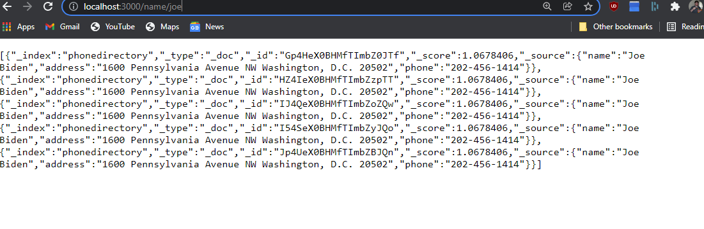

# Directory 
Berevity being the soul of wit and such...  

Unfortunately, I decided to use node, express, and elasticsearch. I think I could have been done far quicker with dotnet core 3.1 using sqlite, but I believed that this route displayed more flexibility, adaptability, and willingness to learn new technologies in a short turnaround.

This could easily be expanded to further endpoints, or expanded to expose more of the elasticsearch functionality as a wrapper. However, it needs a good cleaning and refactor first.

Here's the [ugly code](/index.js), and [external dependencies](/package.json).

## Data Setup
This example app uses a local elasticsearch as the backend, running in a docker container.

https://hub.docker.com/_/elasticsearch

>docker pull elasticsearch:7.14.2

>docker network create somenetwork
>docker run -d --name elasticsearch --net somenetwork -p 9200:9200 -p 9300:9300 -e "discovery.type=single-node" elasticsearch:7.14.2

It's not super REST-y, but to setup the data (bulk load [the data](/data.json) into elasticsearch), hit the /setup endpoint to load the example json into the elasticsearch running in the container above.

Ideally this should only be done once, but throw caution to the wind. live a little. (This also demonstrates multiple values with the same name returning, tbf).

## App Setup
This app was quickly written using express and nodejs, so in your terminal--  

>node index.js

then, in a browser, hit http://localhost/3000/name/ + ```<the name you're searching for>```    
Here's a screencap of the app functioning:



## Example Usage

>curl -X GET "http://localhost/3000/name/joe"

>curl -X GET "http://localhost/3000/name/pet"

By definition JSON is object oriented, it's in the name.

### References

https://www.elastic.co/guide/en/elasticsearch/client/javascript-api/current/api-reference.html
https://github.com/elastic/elasticsearch-js